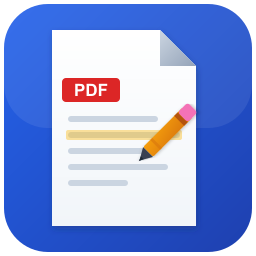

<p align="center">
  
</p>

<h1 align="center">Open PDF Studio</h1>

<p align="center">
  <strong>A free, open-source PDF editor and annotator for Windows, macOS, and Linux.</strong>
</p>

<p align="center">
  <a href="https://github.com/OpenAEC-Foundation/OpenPDFStudio/releases/latest"></a>
  <a href="LICENSE.md"></a>
  <a href="https://snapcraft.io/open-pdf-studio"></a>
  <a href="https://github.com/OpenAEC-Foundation/OpenPDFStudio/releases"></a>
</p>

---

Open PDF Studio is a lightweight, native desktop application that provides professional-grade PDF annotation, markup, and editing tools without subscriptions, telemetry, or bloatware. Built with [Tauri](https://tauri.app/) and web technologies, it delivers a fast, modern experience on Windows, macOS, and Linux.

<p align="center">
  
</p>

<p align="center">
  
  
</p>

## Why Open PDF Studio?

Commercial PDF editors lock essential features behind expensive subscriptions and collect user data. Open PDF Studio gives you the tools you need for free.

| | Open PDF Studio | Adobe Acrobat Pro | Foxit PDF Editor | PDF-XChange Editor |
|---|:---:|:---:|:---:|:---:|
| **Price** | Free | $240/year | $130/year | $62+ |
| **License** | Open Source (LGPL-3.0) | Subscription only | Subscription or perpetual | Perpetual |
| **Annotations & markup** | All included | Paid | Paid | Most free (watermarked) |
| **Signatures** | Included | Paid | Included | Included |
| **Stamps & watermarks** | Included | Paid | Paid | Paid |
| **Page management** | Included | Paid | Paid | Paid |
| **Measurement tools** | Included | Paid | Paid | Paid |
| **Redaction** | Included | Paid | Paid | Paid |
| **Form filling** | Included | Free | Free | Free |
| **Multi-tab editing** | Included | Not available | Included | Included |
| **Telemetry / data collection** | None | Yes | Yes | Minimal |
| **Cross-platform** | Windows, macOS, Linux | Windows, macOS | Windows, macOS, Linux | Windows only |
| **Auto-updates** | Built-in | Built-in | Built-in | Built-in |

## Features

### PDF Viewing & Navigation
- High-quality rendering powered by PDF.js
- Zoom controls (fit page, fit width, actual size, custom %)
- Page navigation with thumbnails panel
- Text search with match case, whole word, and highlight all
- Page rotation (90/180/270 degrees)
- Bookmarks, layers, and named destinations panels

### Annotations & Markup (22+ Tools)
- **Text markup:** Highlight, underline, strikethrough on selected text
- **Shapes:** Rectangle, ellipse, polygon, cloud, line, arrow, polyline
- **Freehand drawing:** Pen tool with configurable color, width, and opacity
- **Text annotations:** Text box, callout with pointer, sticky notes
- **Stamps:** 10 built-in stamps (Approved, Rejected, Draft, Confidential, Final, and more)
- **Images:** Insert from file, paste from clipboard, or drag-and-drop
- **Redaction:** Mark areas and apply to permanently remove content
- **Smart guides:** Snap alignment when positioning annotations
- **Multi-select:** Rubber band selection with alignment and distribution tools
- **Z-order control:** Bring to front, send to back, bring forward, send backward
- **Properties panel:** Full control over color, opacity, line width, font, and more

### Signatures
- Draw signatures with multi-stroke support
- Save up to 5 signatures for quick reuse
- Customizable signature color

### Measurement Tools
- Distance, area, and perimeter measurement
- Scale calibration with support for mm, cm, inches, and points
- Measurement values displayed directly on the document

### Page Management
- Insert blank pages (standard paper sizes or custom)
- Delete, extract, and replace pages
- Reorder pages via drag-and-drop in the thumbnail panel
- Merge multiple PDFs
- Copy and paste pages between documents

### Watermarks & Headers/Footers
- Text watermarks with font, color, opacity, rotation, and position controls
- Image watermarks
- Headers and footers with variables ({page}, {pages}, {date}, {time}, {filename})
- Apply to specific page ranges
- Manage and remove existing watermarks

### Printing
- Full print dialog with live preview
- Printer selection with status display
- Page range, subset (odd/even), reverse order, copies, and collation
- Scaling options: fit, actual size, custom percentage
- Page setup with paper size, orientation, and margins
- Print as image option
- Virtual printer installation (Windows)

### Edit Text
- Edit existing PDF text content with inline editing
- Cover-and-replace approach for broad compatibility

### Forms
- Fill interactive PDF forms (AcroForms and XFA)
- Checkbox, radio button, dropdown, and text field support
- JavaScript validation support

### Export
- Export pages as PNG or JPEG images with configurable DPI
- Export as raster PDF
- Full page and region screenshots

### Document Management
- Multi-tab interface for working with multiple PDFs simultaneously
- Session restore on startup
- Unsaved changes detection with save prompt
- Document properties dialog (metadata, page info, file size)
- XFDF annotation import and export
- File attachments panel (add, open, save, delete embedded files)

### Left Panel (10 Tabs)
Thumbnails, Bookmarks, Annotations list, Attachments, Digital signatures, Layers, Form fields, Named destinations, Links, Tags (accessibility structure)

### Customization
- **5 themes:** Dark, Light, Blue, High Contrast, and System (auto-detects OS preference)
- Per-annotation-type default styles
- Configurable preferences with dedicated dialog
- Microsoft Office-style ribbon interface

### Undo/Redo
- Up to 100 levels of undo covering all operations
- Annotations, page management, watermarks, text edits, and more

### Auto-Update
- Built-in update checker with download progress
- "Skip This Version" and "Remind Me Later" options
- Automatic installation and relaunch

## Installation

### Windows
Download the latest `.exe` installer from [Releases](https://github.com/OpenAEC-Foundation/OpenPDFStudio/releases/latest).

### macOS
Download the latest `.dmg` from [Releases](https://github.com/OpenAEC-Foundation/OpenPDFStudio/releases/latest).

### Linux

**Snap (Ubuntu App Center):**
```bash
sudo snap install open-pdf-studio
```

**Debian/Ubuntu (.deb):**
```bash
# Download the .deb from the latest release
sudo dpkg -i open-pdf-studio_*.deb
```

**AppImage:**
```bash
chmod +x open-pdf-studio_*.AppImage
./open-pdf-studio_*.AppImage
```

## Building from Source

### Prerequisites
- [Node.js](https://nodejs.org/) 20+
- [Rust](https://www.rust-lang.org/tools/install) (stable)
- System dependencies:
  - **Linux:** `libwebkit2gtk-4.1-dev libappindicator3-dev librsvg2-dev patchelf`
  - **macOS:** Xcode Command Line Tools
  - **Windows:** Visual Studio Build Tools with C++ workload

### Build

```bash
cd open-pdf-studio
npm install
npx tauri build
```

The built application will be in `open-pdf-studio/src-tauri/target/release/bundle/`.

### Development

```bash
cd open-pdf-studio
npm install
npx tauri dev
```

## Tech Stack

| Layer | Technology |
|-------|-----------|
| Desktop framework | [Tauri 2](https://tauri.app/) (Rust backend) |
| Frontend | Vanilla JavaScript, HTML, CSS |
| Build tool | [Vite](https://vitejs.dev/) |
| PDF rendering | [PDF.js](https://mozilla.github.io/pdf.js/) |
| PDF manipulation | [pdf-lib](https://pdf-lib.js.org/) |

## Keyboard Shortcuts

| Shortcut | Action |
|----------|--------|
| `Ctrl+N` | New document |
| `Ctrl+O` | Open file |
| `Ctrl+S` | Save |
| `Ctrl+Shift+S` | Save As |
| `Ctrl+P` | Print |
| `Ctrl+Z` | Undo |
| `Ctrl+Y` | Redo |
| `Ctrl+F` | Find |
| `Ctrl+A` | Select all annotations on page |
| `Ctrl+C` / `Ctrl+V` | Copy / Paste |
| `V` | Select tool |
| `H` | Hand tool |
| `T` | Text box tool |
| `N` | Sticky note tool |
| `1`-`5` | Quick tool selection |
| `F9` | Toggle thumbnail panel |
| `F11` | Toggle annotations list |
| `F12` | Toggle properties panel |
| `Arrow keys` | Nudge annotation (1px, Shift for 10px) |

## Contributing

Contributions are welcome. Please open an issue to discuss proposed changes before submitting a pull request.

## License

Open PDF Studio is licensed under the [GNU Lesser General Public License v3.0](LICENSE.md).

PDF.js is licensed under the Apache License 2.0. pdf-lib is licensed under the MIT License.
